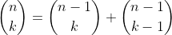

Create a procedure to calculate bionomial coefficients  by the following algorithm. When k=0 or k=n, set =1. Otherwise, use the Pascal's triangle identity: . This can be done recursively, but if the recursion is done naively, the same binomial coefficients are recalculated many times. Instead, devise a procedure that never calculates any binominal coefficient more than once.


```
#include <iostream>
#include <map>
#include <utility>

using namespace std;


long binomial(int n , int k){
  pair<int ,int> n_k;
  static map<pair<int,int>, long> table;

  if (k==0){return 1;}
  if (n == k){return 1;}
  if(n < k){return 0;}

  n_k = make_pair(n,k);

  if (table.count(n_k)>0){return table[n_k];}

  table[n_k] = binomial( n-1 , k-1 ) + binomial(n-1, k);

  return table[n_k];
};

```

[file .cpp](main.cpp)
[Repository link](https://github.com/schaeferrodrigo/LearningCplusplus/tree/master/C%2B%2B_for_mathematicians_book/chapter_8_Containers/C8E7)
