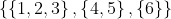
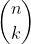

# Exercises - Chapter 8


## Exercise 1.

In Mathematics, the elements of a set can themselves be sets. Show how to declare a set of sets of integers in C++ and write a short program that creates the set .


## Exercise 2.

Write a procedure to print set of long integers to the screen. The elements of the set should be enclosed between curly braces and separated by commas. (Be sure that the last element of the set is not followed by a comma.)

## Exercise 3.


Suppose we wish to use sets of complex numbers in a program. As a test, we create this simple program
```
#include <complex>
#include <set>
using namespace std;

int main(){
  complex<double> z(2.,3.);
  set< complex<double> > A;
  A.insert(z);
  return 0;
}
```

This program creates a complex number z = 2 + 3i  and a set of complex numbers A into which we insert z. Unfortunately, the computer fails to compile this code and, and instead, prints out a long stream of error message that includes a complaint that there is

```
no match for const std::complex<double>& < const std::complex<double>&' operator
```

What is wrong and how we can fix this?

## Exercise 5.

Create a class to represent integer partitions. Given a nonnegative integer n, a partition of n is a multiset of positive integers whose sum is n; the elements of the multiset are called the parts of the partition.

Name your class Partition and give it the following capabilities:

* A constructor that creates the empty partition of 0.
* An  add_part method for adding a part.
* A get_sum method for learning the sum of the parts in the partition (i.e., the number partitioned by this Partition).
* An nparts method that reports the number of parts in the partition.
* A get_parts that returns the parts of the partition in a vector<int> container.
* An operator< to give a total order in the set of integer partitions.
* An operator<< for writing Partition objects to the screen. Choose an attractive output format. For example, the partition {1,1,3,4} of 9 can be written to the screen as 9 = 4+3+1+1.

## Exercise 7.

Create a procedure to calculate bionomial coefficients  by the following algorithm. When k=0 or k=n, set =1. Otherwise, use the Pascal's triangle identity: 
 
